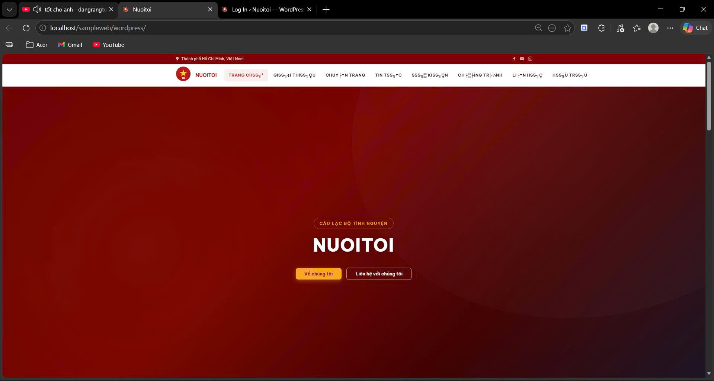
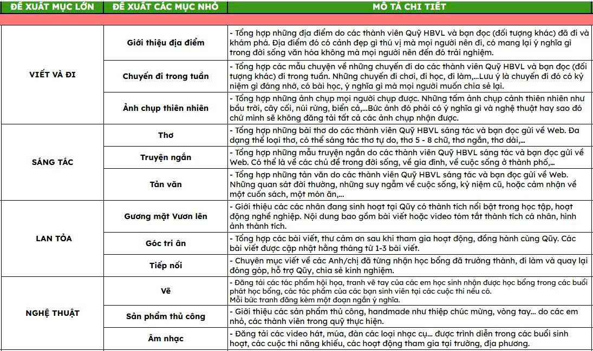

# RiseUp Scholarship Website

<p align="center">
  
</p>

WordPress project for **Học Bổng Vươn Lên (RiseUp Scholarship)** under **Quỹ Khuyến Học Đông Du**.

This repository contains a full WordPress setup and the custom theme `charity-hcm`, including bilingual content (VI/EN), announcement feed, frontend post submission, contact page, and responsive UI.

## Highlights

- Bilingual switch VI/EN with cookie-based translator helper
- Custom scholarship theme (`charity-hcm`) with responsive layout
- Story feed with reactions and comments
- Frontend post submission flow (pending moderation)
- Announcement and contact page templates
- Local and production config templates

## Unified Repository Structure

```text
RiseUp/
├── config/
│   ├── content-pillars.json
│   ├── wp-config.local.php
│   └── wp-config.prod.php
├── database/
│   └── sampleweb_wp_export.sql
├── docs/
│   ├── LOCAL_SETUP.md
│   ├── DEPLOY_GUIDE.md
│   ├── DEVELOPMENT_GUIDE.md
│   ├── TRANSLATION_GUIDE.md
│   ├── PLAN.md
│   └── screenshots/
│       ├── localhost-home.jpg
│       ├── localhost-announcements.jpg
│       └── localhost-contact.jpg
└── wordpress/
    └── wp-content/themes/charity-hcm/
```

> [!NOTE]
> Redundant local copies were removed. This root structure is now the single source of truth.

## Localhost Preview

### Homepage


### Announcements


### Contact


## Quick Start (Local)

1. Copy `config/wp-config.local.php` to `wordpress/wp-config.php`.
2. Create database `sampleweb_wp`.
3. Import `database/sampleweb_wp_export.sql`.
4. Start Apache + MySQL.
5. Open `http://localhost/sampleweb/wordpress`.

Detailed setup: [docs/LOCAL_SETUP.md](docs/LOCAL_SETUP.md)

## Deployment

Production deployment guide: [docs/DEPLOY_GUIDE.md](docs/DEPLOY_GUIDE.md)

## Development Docs

- [docs/DEVELOPMENT_GUIDE.md](docs/DEVELOPMENT_GUIDE.md)
- [docs/TRANSLATION_GUIDE.md](docs/TRANSLATION_GUIDE.md)
- [docs/PLAN.md](docs/PLAN.md)

## Tech Stack

- WordPress 6.x
- PHP 8+
- MySQL / MariaDB
- Custom PHP theme + vanilla CSS/JS
